<div align="center">

# 🛒 TechShop Leap

### Electronics Online Store — Web Application Development Assignment

*Built with PHP · MySQL · HTML · CSS · JavaScript (No frameworks)*


</div>

---

## 📋 Table of Contents

- [About](#about)
- [Screenshots](#screenshots)
- [Features](#features)
- [Tech Stack](#tech-stack)
- [Getting Started](#getting-started)
- [Demo Accounts](#demo-accounts)
- [Project Structure](#project-structure)
- [Database Schema](#database-schema)
- [CRUD Operations](#crud-operations)
- [Team](#team)

---

## About

**TechShop Leap** is a dynamic e-commerce web application specialising in electronics — laptops, smartphones, audio devices, monitors and accessories. It was developed as a group assignment for the **UECS2094 / UECS2194 / EECS2194 Web Application Development** course at **Universiti Tunku Abdul Rahman (UTAR)**.

The application demonstrates full-stack web development using only core web technologies — no external frameworks, CSS libraries or JavaScript libraries are used.

---

## Screenshots

### Home Page
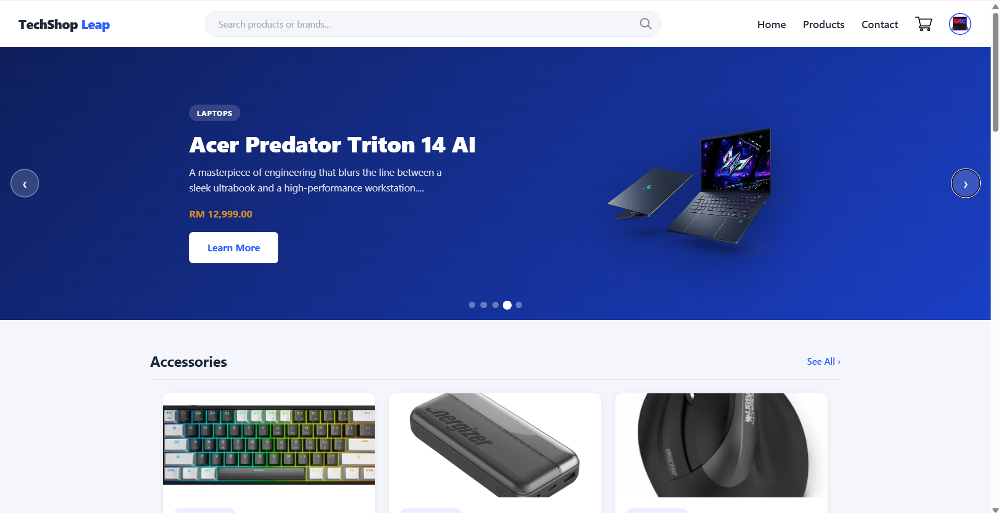
*Carousel with auto-flip transition, featured category sections and sticky nav with search bar*

### Product Listing
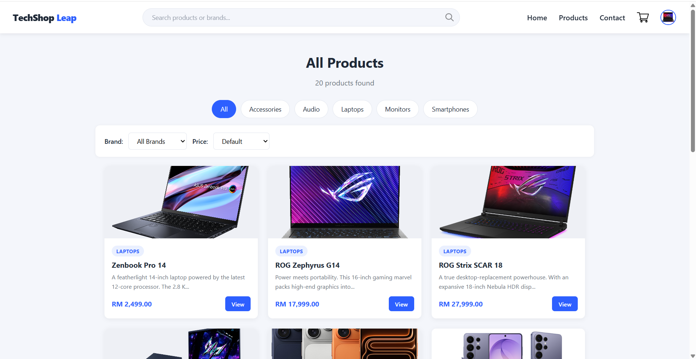
*9 products per page with category filter, brand filter, price sort and pagination*

### Product Details
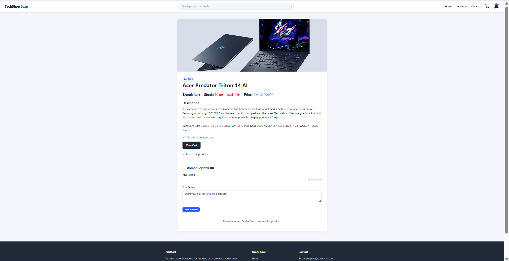
*Full product info, add-to-cart button and customer star reviews*

### Shopping Cart
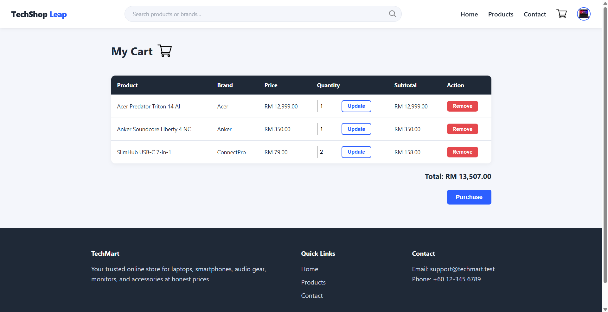
*Cart management with quantity update, remove item and purchase modal*

### Purchase Modal
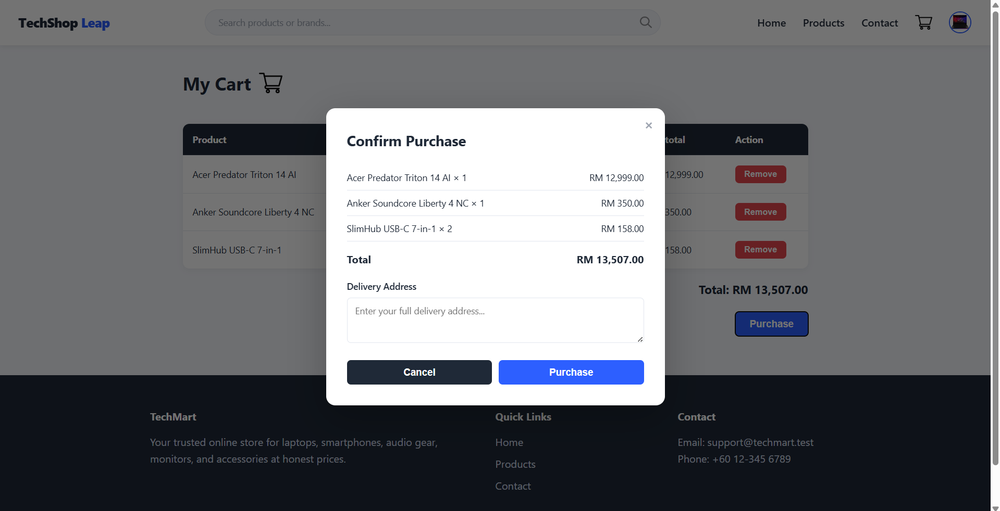
*Inline purchase confirmation with delivery address input and success message*

### Search Results
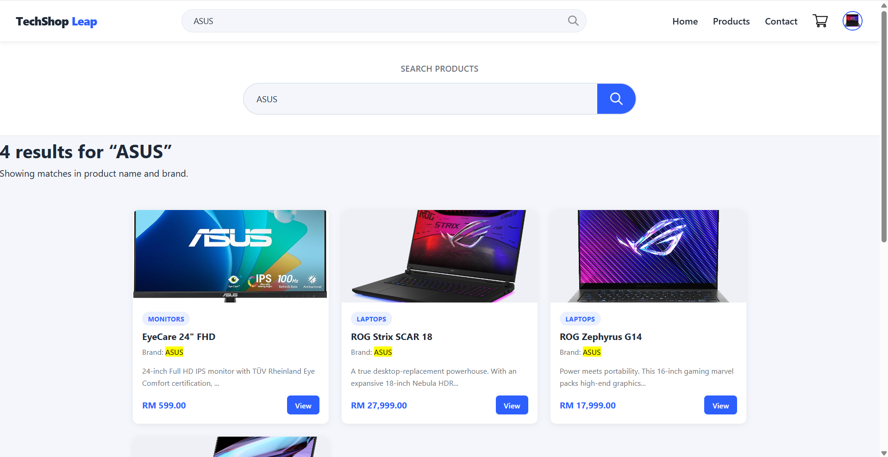
*Search by product name or brand with keyword highlighting in results*

### User Profile
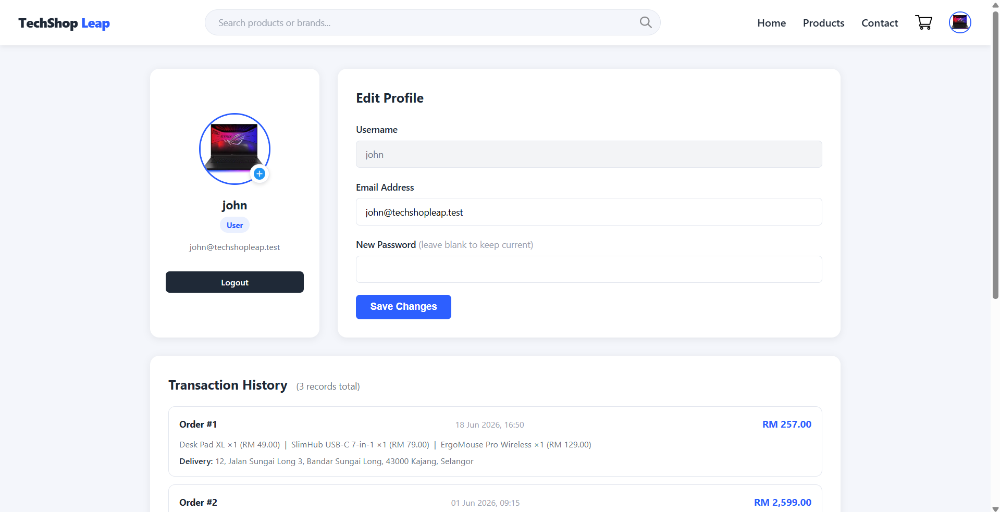
*Profile picture upload, edit profile and transaction history with pagination*

### Login
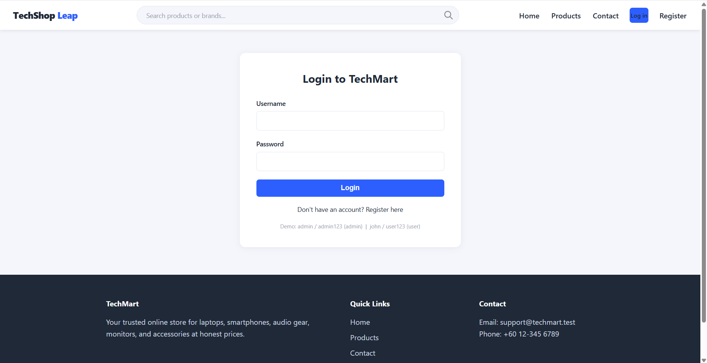
*Login as normal user or damin

### Admin — Manage Products
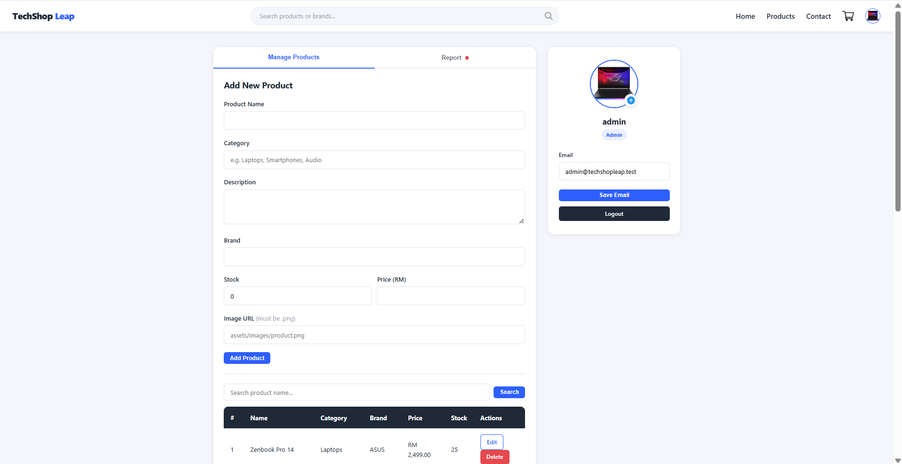
*Product search bar, paginated table and full add/edit/delete CRUD*

### Admin — Report
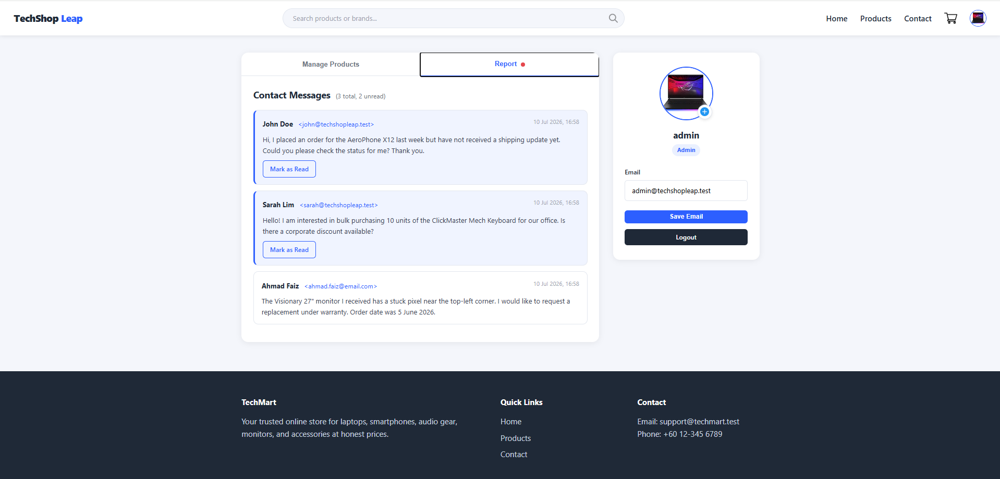
*Contact messages with unread dot indicator and pagination*

### Contact Page
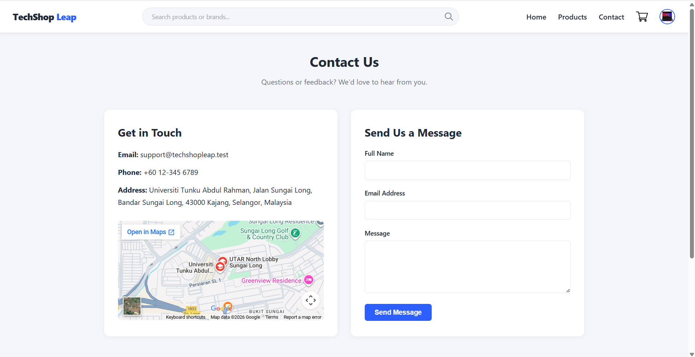
*Contact form with Google Maps embed — messages delivered to admin Report tab*

---

## Features

### 🏠 Home Page
- Auto-flipping product carousel (every 3 seconds) with back/next arrows and dot indicators
- Featured products grouped by category with **See All →** navigation
- Sticky navigation bar visible while scrolling on all pages

### 🔍 Search
- Search bar in the navigation header (available on every page)
- Searches across **product name** and **brand** simultaneously
- Results sorted by relevance with matched keyword highlighted in yellow

### 📦 Products
- Browse all products or filter by category using pills
- Filter by **brand** (dropdown) and sort by **price** low→high or high→low
- **9 products per page** with `<` `>` pagination buttons

### 🛒 Cart & Purchase
- Add products from the product details page
- Update quantity or remove items directly in the cart
- **Purchase modal** — no page switch needed, shows full order summary
- Delivery address input inside modal
- ✓ Success confirmation popup after purchase
- Purchase history saved to user profile

### 👤 User Profile
- Circle profile picture with **PNG-only upload**
- Edit email address and password
- Full transaction history — 10 records per page, unlimited records stored

### 🔧 Admin Profile
- **Manage Products tab** — add, edit, delete; search by product name; 10 per page
- **Report tab** — contact messages from users; unread red dot; 10 per page
- Admin updates email only (no password change)

### ⭐ Reviews
- Logged-in users can leave a 1–5 star rating and comment on any product
- Average rating shown on product details page
- Users can delete their own reviews; admin can delete any review

### 🔒 Security
- Passwords hashed with PHP `password_hash()` (bcrypt)
- All database queries use **prepared statements** (SQL injection protection)
- XSS protection via `htmlspecialchars()` on all output
- Role-based access control (`user` / `admin`)
- PNG-only enforcement on all image uploads

### 📱 Responsive Design
- Mobile, tablet and desktop layouts
- CSS `@media` queries only — zero frameworks
- Hamburger menu on mobile, search bar drops to full-width row

---

## Tech Stack

| Layer | Technology |
|---|---|
| Frontend | HTML5, CSS3, Vanilla JavaScript ES6 |
| Backend | PHP 8.x |
| Database | MySQL 8.0 |
| Server | Apache via WAMPServer |
| Styling | Custom CSS (no Bootstrap or Tailwind) |
| No frameworks | ✅ Bootstrap · jQuery · React · Laravel — none used |

---

## Getting Started

### Prerequisites
- [WAMPServer](https://www.wampserver.com/) installed (green tray icon = running)
- Modern web browser (Chrome, Edge, Firefox)

### Installation

**1. Clone or download this repository**
```bash
git clone https://github.com/your-username/techshop-leap.git
```

**2. Copy to WAMPServer www folder**
```
C:\wamp64\www\techmart\
```
Verify: `C:\wamp64\www\techmart\index.php` should exist.

**3. Import the database**
- Go to `http://localhost/phpmyadmin`
- Login: username `root`, password *(blank)*
- Click **Import** → **Choose File** → select `database.sql`
- Click **Go**

**4. Check database config**

Open `includes/db.php` — change only if your MySQL root has a password:
```php
$DB_HOST = "localhost";
$DB_USER = "root";
$DB_PASS = "";        // ← add password here if needed
$DB_NAME = "techmart";
```

**5. Add PNG images to `assets/images/`**

| Filename | Purpose |
|---|---|
| `default-user.png` | Default profile avatar |
| `default-product.png` | Fallback product image |
| `cart-icon.png` | Cart icon in navigation bar |
| `search-icon.png` | Search icon inside search bar |
| `upload-icon.png` | Upload button on profile page |
| `product1.png` — `product20.png` | Product images for listings |

**6. Visit the site**
```
http://localhost/techmart/
```

---

## Demo Accounts

| Role | Username | Password |
|---|---|---|
| 👑 Admin | `admin` | `admin123` |
| 👤 User | `john` | `user123` |
| 👤 User | `sarah` | `user123` |

Admin → click profile circle → **Manage Products** or **Report** tabs

---

## Project Structure

```
techmart/
│
├── index.php                   # Home page (carousel + featured products)
├── products.php                # Product listing (filter, sort, pagination)
├── product_details.php         # Product details + reviews + add to cart
├── cart.php                    # Shopping cart + purchase modal
├── search.php                  # Search results page
├── contact.php                 # Contact form → admin Report tab
├── login.php                   # User login
├── register.php                # User registration
├── logout.php                  # Session destroy
├── profile.php                 # User & admin profile page
│
├── cart_action.php             # Add / update / remove cart items
├── purchase_action.php         # AJAX purchase handler
├── review_action.php           # Delete review handler
├── upload_profile_pic.php      # AJAX profile picture upload
│
├── admin/
│   └── products.php            # Redirects → profile.php?tab=products
│
├── includes/
│   ├── db.php                  # MySQL connection
│   ├── auth.php                # Session helpers + getProfilePic()
│   ├── header.php              # Sticky header + search bar + nav
│   └── footer.php              # Footer (every page)
│
├── assets/
│   ├── css/
│   │   ├── base.css            # Variables, reset, buttons, flash
│   │   ├── layout.css          # Header, nav search bar, footer
│   │   ├── home.css            # Carousel, featured sections
│   │   ├── products.css        # Product grid, filters, pagination
│   │   ├── details.css         # Product details, reviews
│   │   ├── cart.css            # Cart table, purchase modal
│   │   ├── forms.css           # All form styles
│   │   ├── contact.css         # Contact page layout
│   │   ├── profile.css         # User + admin profile layouts
│   │   ├── search.css          # Search results page
│   │   └── responsive.css      # All @media queries
│   ├── js/
│   │   └── script.js           # Carousel, modal, purchase, upload
│   └── images/                 # PNG product images + UI icons
│
├── database.sql                # Complete DB setup (single import)
├── .gitignore
└── README.md
```

---

## Database Schema

```
┌─────────────┐     ┌──────────────┐     ┌─────────────┐
│    users    │     │   products   │     │ cart_items  │
├─────────────┤     ├──────────────┤     ├─────────────┤
│ user_id  PK │──┐  │ product_id PK│──┐  │ cart_id  PK │
│ username    │  │  │ name         │  │  │ user_id  FK │
│ email       │  │  │ category     │  └──│ product_id  │
│ password    │  │  │ description  │     │ quantity    │
│ role        │  │  │ brand        │     │ added_at    │
│ profile_pic │  │  │ stock        │     └─────────────┘
│ created_at  │  │  │ price        │
└─────────────┘  │  │ image_url    │     ┌─────────────┐
                 │  │ created_at   │     │   reviews   │
┌──────────────┐ │  └──────────────┘     ├─────────────┤
│ transactions │ │                       │ review_id PK│
├──────────────┤ │                    ┌──│ product_id  │
│ trans_id  PK │ │                    │  │ user_id  FK │
│ user_id   FK │─┘  ┌──────────────┐  │  │ rating      │
│ items_json   │    │contact_msgs  │  │  │ comment     │
│ total_amount │    ├──────────────┤  │  │ created_at  │
│ address      │    │ message_id PK│  │  └─────────────┘
│ purchased_at │    │ name         │  │
└──────────────┘    │ email        │  │
                    │ message      │  │
                    │ is_read      │  │
                    │ sent_at      │ ——
                    └──────────────┘ 
```

---

## CRUD Operations

| Operation | Pages / Files |
|---|---|
| **Create** | `register.php` (account), `cart_action.php` (add to cart), `product_details.php` (review), `contact.php` (message), `profile.php` admin tab (add product), `purchase_action.php` (transaction) |
| **Read** | `products.php`, `product_details.php`, `cart.php`, `search.php`, `profile.php` (transactions + admin report) |
| **Update** | `cart_action.php` (quantity), `profile.php` (email/password), admin edit product, `profile.php` (mark message read) |
| **Delete** | `cart_action.php` (remove item), `review_action.php` (delete review), admin delete product |

---

## Team

| Name | Student ID | Contribution |
|---|---|---|
| Member 1 | 12XXXXXX | Home page, Carousel, Search feature |
| Member 2 | 12XXXXXX | Products page, Product Details, Reviews |
| Member 3 | 12XXXXXX | Cart, Purchase system, Authentication |
| Member 4 | 12XXXXXX | Profile page, Admin panel, Contact page |

> ✏️ Replace the above with your actual names and student IDs before submitting.

---

<div align="center">

**Web Application Development**
Universiti Tunku Abdul Rahman (UTAR) · Sungai Long Campus

</div>
